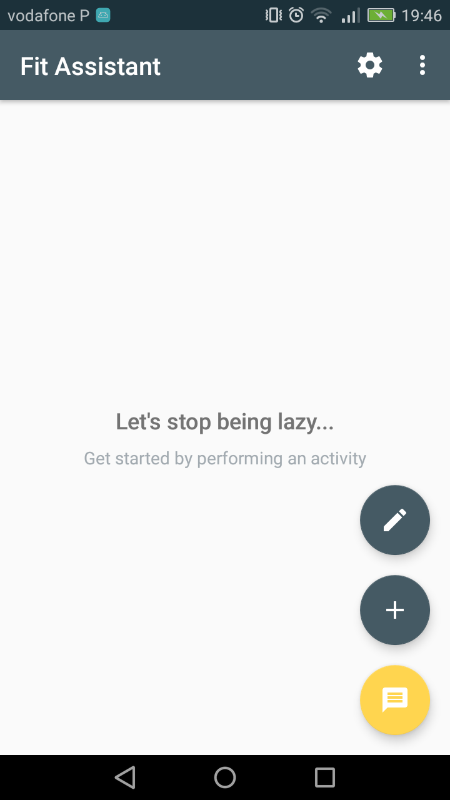
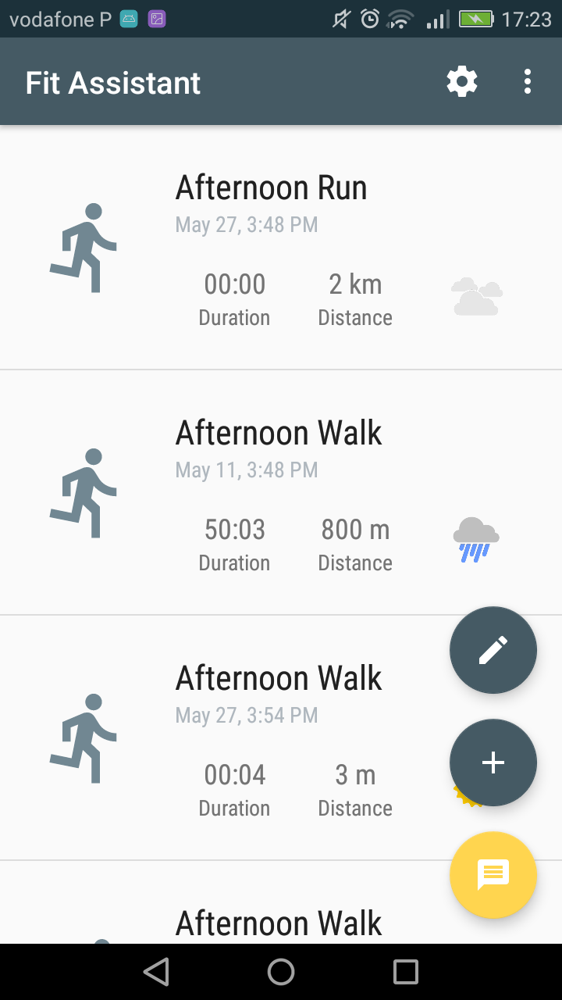

# Fit Assistant
Fit Assistant is an android application that allows the user to perform and monitor
a set of predefined physical activities such as running, walking and biking. Because
being active can be a very lonely task the user can interact with a personal assistant
to get information such as the current weather or nearby places to perform their 
physical activities. 

Most of the application features were implemented using the [Google Awareness Api](https://developers.google.com/awareness/) and the 
[Google Places Api](https://developers.google.com/places/).

    
    

